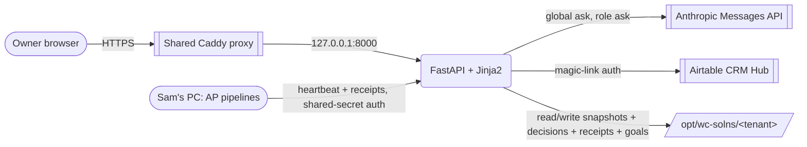

# WCAS Client Dashboard

> The agency-level client dashboard for WestCoast Automation Solutions. Live
> automation telemetry, a global *Ask your business* surface, a receipts
> drawer that proves what we sent on your behalf, and an approval queue for
> the messages you want to see before they go out.

**Hackathon submission:** [Built with Opus 4.7](https://cerebralvalley.ai/e/built-with-4-7-hackathon) on Cerebral Valley, Apr 21-26, 2026.

**Live:** [dashboard.westcoastautomationsolutions.com](https://dashboard.westcoastautomationsolutions.com) · `{"status":"ok","version":"0.4.0"}` on `/healthz`.

**For judges:** see [`docs/judge.md`](./docs/judge.md) for the one-page tour.

## What it does

Owner-operators in service businesses buy the WCAS ten-automation platform -
SEO, blogs, Google Ads, sales pipeline, email assistant, GBP, reviews, voice
agent, social, and QBRs. Automations that ship without a live monitoring
surface turn into a black box. This dashboard is the surface.

0. **Activation wizard** - new owner lands on `/activate`, chats with the
   Activation Orchestrator (Managed Agent, 14 tools), and one Google OAuth
   click connects 3 roles (GBP, SEO, Reviews). The agent reads their site,
   confirms basics, provisions a GA4 property + a Search Console site,
   and narrates what it found using real numbers. Hero demo.
1. **Home** - a 14-role grid with live status and a narrative summary. Hero
   stats show Weeks Saved, Revenue Influenced, and Goal Progress.
2. **Global Ask (Opus 4.7 flagship)** - `Cmd-K`, type `?`, ask your business
   anything. One single-shot call against the entire tenant workspace
   (heartbeats + decisions + goals + KB + brand + receipts). Cited answer
   with per-call cost visible. Rate-limited to 2/min, prompt-cached.
3. **Receipts drawer** - per-role audit of every outbound message
   auto-sent on the owner's behalf. Privacy mode blurs PII.
4. **Approve before send** - per-pipeline toggle that queues every draft to
   `/approvals` where the owner reviews with `A`/`E`/`S`/`J`/`K` keyboard
   shortcuts. 10-second undo on every approve.
5. **Sidebar that earns its space** - per-role health dots (pulse if the
   role ran in the last 60 seconds), rail-top status strip, recent-ask
   pills that remember your last three questions.

## Architecture (Mermaid)



## How Opus 4.7 shows up

| Surface | Endpoint | Model use |
|---|---|---|
| Activation Orchestrator | `/api/activation/chat` | **Managed Agents beta.** One shared agent + per-tenant session, 14 custom tools (site-fetch, company facts, OAuth credential, pipeline ring advance, baseline capture, GA4 provisioning, GSC add-site, KB writes). Drives the full activation conversation. |
| Global Ask | `/api/ask_global` | **1M-context single-shot**, system prompt cache-flagged. Flagship. |
| Per-role Ask | `/api/ask` | Grounded on one heartbeat, 512-token cap, prompt-cached. |
| Recommendations engine | `services/recs_generator.py` | Single Messages API call over the full tenant workspace (heartbeats + decisions + goals + KB + brand), 1M context window, no RAG. |
| Guard-rail review (mechanical) | `services/guardrails.py` | Strips em dashes + vendor leaks before anything outbound. |

Every Opus call routes through `services/opus.py:chat()`, which enforces the
`DAILY_DEV_CAP` + `DAILY_TENANT_CAP` budget gates and records per-call cost
in `/opt/wc-solns/_platform/cost_log.jsonl`.

## Platformization seeds

Five choices made this week to preserve the license-to-sub-agency option:

1. **Tenant-scoped everything.** Every route, file path, and cookie takes
   `tenant_id`. No hardcoded strings in `dashboard_app/`.
2. **Per-tenant brand override.** `/opt/wc-solns/<tenant>/brand.json`
   swaps logo/colors/fonts via CSS custom properties.
3. **Per-client knowledge base.** `kb/*.md` files per tenant ground every
   Opus surface.
4. **Guard-rail seam.** One `review_outbound()` chokepoint; every outbound
   pipeline calls it.
5. **Goals schema.** `goals.json` with metric/target/timeframe; hero stats
   wake up from here, post-hackathon an auto-tuner reads them to bias
   automations.

## Local dev

```bash
git clone https://github.com/suaveshot/wcas-client-dashboard.git
cd wcas-client-dashboard
cp .env.example .env   # fill ANTHROPIC_API_KEY, AIRTABLE_PAT, SESSION_SECRET

python -m venv .venv
source .venv/bin/activate           # .venv\Scripts\activate on Windows
pip install -r requirements.txt

uvicorn dashboard_app.main:app --reload

# Seed demo data for the receipts drawer + approvals inbox
python scripts/seed_receipts.py demo_tenant
python scripts/seed_drafts.py   demo_tenant
```

Open <http://localhost:8000>.

## Deploying to the VPS

```bash
ssh root@<vps-ip>
cd /docker/wcas-dashboard/app
git pull
cd ..
docker compose up -d --build
```

See [`docs/deploy.md`](./docs/deploy.md) for the full runbook. The production
proxy is a shared Caddy instance on the host, not Traefik.

## Build in the open

- [`JOURNAL.md`](./JOURNAL.md) - timestamped daily build log (14 entries across 5 days)
- [`DECISIONS.md`](./DECISIONS.md) - 28 architecture decision records
- [`docs/judge.md`](./docs/judge.md) - hackathon judge quickstart

## Credits + cost discipline

Every Claude call records a JSONL row with tenant + model + tokens + USD to
`/opt/wc-solns/_platform/cost_log.jsonl`. Two caps kick in before a call
even fires: `DAILY_DEV_CAP` (platform-wide) and `DAILY_TENANT_CAP`
(per-tenant kill switch). Swap the activation model via
`ACTIVATION_AGENT_MODEL=claude-haiku-4-5-20251001` for dev; opus for demo.
The repo is public from Day 1 so every credit burn is auditable.

## License

Code: [MIT](./LICENSE). WCAS brand assets (logo, tokens, copy): proprietary.

---

*Built solo Apr 21-26, 2026. See [JOURNAL.md](./JOURNAL.md) for the full story.*
